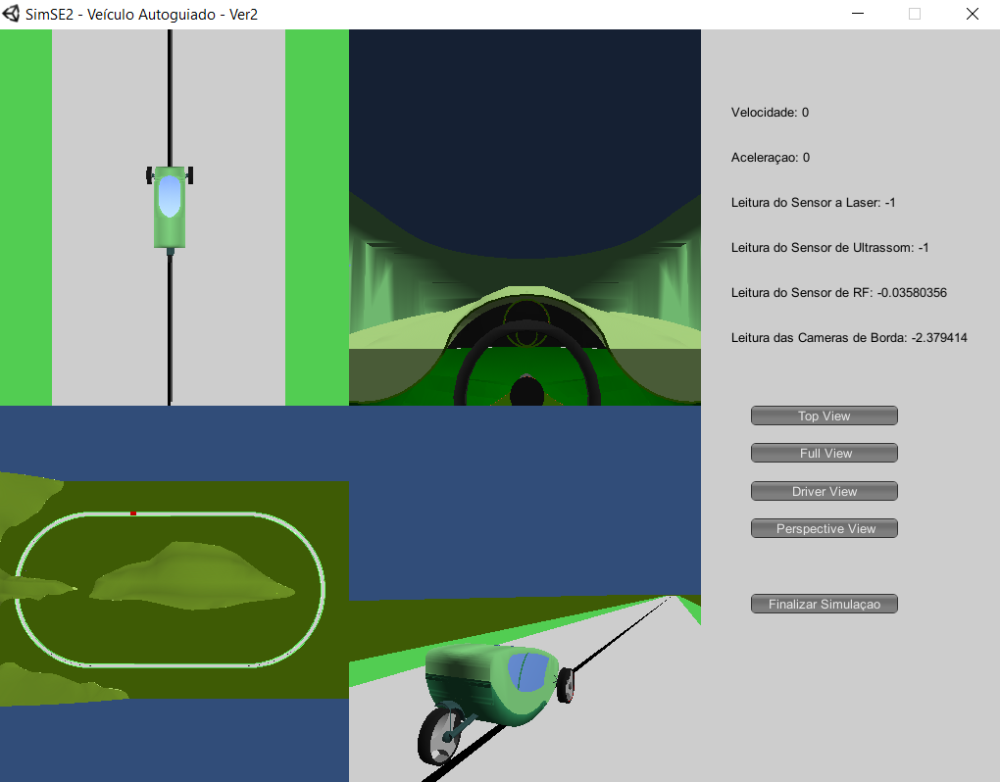

# auto-guided-vehicle

Final project for the Embedded Systems class of [Universidade Tecnológica Federal do Paraná](https://utfpr.edu.br).

The objective is to develop an RTOS based system that is able to guide a simulated vehicle that receives commands through an UART interface.

> Dedicated to our greatly missed Professor Hugo Vieira.
His lessons and dedication will always be remembered.