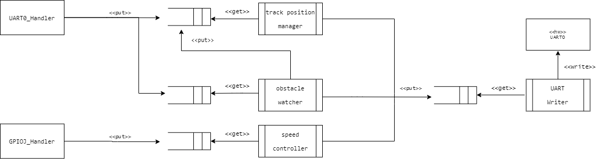

% Projeto Final - Veículo Autoguiado
% Sistemas Embarcados - UTFPR
% Francisco Miamoto - Agosto de 2021

# Introdução 

O presente documento tem como objetivo apresentar os diagramas detalhados do funcionamento
do sistema de controle do veículo autoguiado.

Como primeiro passo, vejamos a arquitetura proposta.

# Arquitetura



Na arquitetura apresentada na Figura 1, podemos notar as cinco
tarefas que compõem a arquitetura:

- `Track Manager`: Responsável por controlar a posição de pista do veículo.

- `Obstacle Watcher`: Responsável por alterar a posição de pista alvo 
em casos de obstáculo detectado.

- `Speed Controller`: Responsável por controlar a velocidade do veículo.

- `UART Writer`: Responsável por realizar escritas na UART.

- `UART Reader`: Responsável por realizar leituras na UART.

Adicionalmente as estas cinco tarefas, foram utilizadas filas de mensagens
para realizar as comunicações entre as tarefas e também temporizadores para
algumas funções específicas.

Na seção a seguir veremos em detalhes o funcionamento esperado para
cada tarefa.

# Diagramas de atividade

## `Track Manager`

A tarefa `Track Manager` será responsável por realizar o controle 
da posição de pista do veículo.

Em seu loop principal, a tarefa irá realizar leituras periódicas
do sensor de RF - que indica desvios em relação ao condutor central -
e calculará um desvio apropriado baseado no valor lido.

A tarefa terá como argumento um valor de referência que será usado
para o calculo do erro.

Este valor poderá ser alterado pela tarefa `Obstacle Watcher`, fazendo
com que o veículo se desloque na pista.


### Mensagens
A mensagem recebida deverá conter uma leitura do sensor de RF
```c
    typedef struct {
        float rf_sensor_reading;
    } track_manager_msg_t
```

## `Obstacle Watcher`

Esta tarefa irá aguardar por um 'aviso' recebido em sua fila de mensagens
proveniente da comunicação que o simulador realiza quando o veículo está
se aproximando de um obstáculo.

Ao receber a mensagem, a tarefa irá alterar o valor de referência utilizado
pela tarefa `Track Manager` com o intuito de deslocar o veículo para a 
esquerda.

Já que não temos sensores laterais, uma estratégia baseado em temporização
é utilizada para que o veículo retorne ao centro da pista após realizar
o desvio do obstáculo.


### Mensagens
A mensagem recebida na fila deverá conter uma leitura do sensor de ultrassom.
```c
    typedef struct {
        float us_sensor_reading;
    } obstacle_watcher_msg_t
```

## `Speed Controller`

Tarefa que irá controlar a velocidade do veículo, recebendo mensagens 
indicando se foi requisitado uma parada ou entrada em movimento.

Caso seja um pedido de parada, enviará uma mensagem à tarefa `UART Writer`
para que seja feita o envio do comando ao simulador.

No caso de um pedido de entrada em movimento, a tarefa também irá enviar 
um comando ao simulador mas também irá disparar um temporizador para
que o comando de parada de aceleração seja enviado.

Idealmente seria possível lermos a velocidade atual do veículo mas
este comando não está disponível.

Um ponto importante é que caso o veículo já esteja em movimento e um
novo pedido de entrada em movimento seja feito, a velocidade aumentará
desde que fique dentro do limite máximo de velocidade estabelecido.

### Mensagens
A tarefa `Speed Controller` deverá receber mensagens vindas do `GPIOJ_Handler`
indicando qual botão foi pressionado.
```c
typedef enum {
  SW1_PRESSED,
  SW2_PRESSED,
} button_event_t;
```


## `UART Writer`
Tarefa que realiza escritas na UART com os conteúdos recebidos
via fila de mensagens.

Evita o uso de um *mutex* já que é a única tarefa que fará envio
de comandos via UART.


### Mensagens
Mensagens com o conteúdo - como uma string terminada em `null` - a ser
escrito na UART.
```c
typedef struct {
    char * content;
} uart_writer_msg_t
```

## `UART Reader`
Responsável pela recepção de mensagens via UART e realizar o direcionamento
para as tarefas apropriadas.

Por exemplo, caso seja recebido uma leitura do sensor de RF, o conteúdo
deve ser processado e direcionado à tarefa `Track Manager`.


### Mensagens
As mensagens enviadas serão aquelas esperadas pelas outras tarefas.

## `GPIOJ_Handler`

Rotina de tratamento de interrupção do Port J. 

Irá enviar mensagens à tarefa `Speed Controller` indicando
que os botões do kit foram pressionados.
