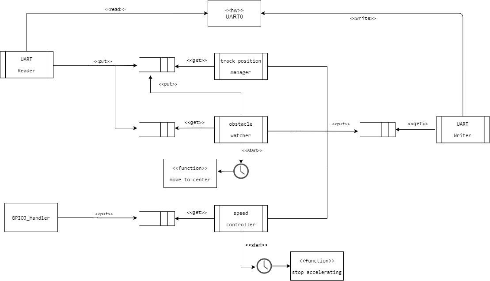

% Projeto Final - Veículo Autoguiado
% Sistemas Embarcados - UTFPR
% Francisco Miamoto - Agosto de 2021

# Introdução 

O presente documento tem como objetivo apresentar os diagramas detalhados do funcionamento
do sistema de controle do veículo autoguiado.

Como primeiro passo, veremos a arquitetura proposta.

## Arquitetura

## Diagramas de atividade

Conhecendo as tarefas envolvidas, a seguir são apresentados os diagramas de atividades
para cada tarefa.

