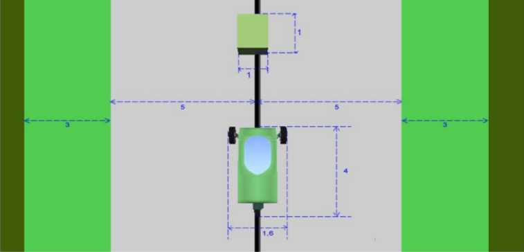

% Projeto Final - Veículo Autoguiado
% Sistemas Embarcados - UTFPR
% Francisco Miamoto - Agosto de 2021

# Introdução 

O presente documento tem por objetivo contextualizar o problema do controle de um
veículo autoguiado em uma pista com obstáculos.

O objetivo principal será garantir que o veículo se locomova dentro dos limites de uma pista oval enquanto desvia de quaisquer obstáculos presentes na mesma.

Para tal, vamos inicialmente apresentar detalhadamente as entidades que compõem o domínio deste problema.

# Entidades

##  Veículo
Entidade a ser controlada, possui a capacidade de acelerar em uma determinada direção - em ambos os sentidos - e de alterar esta mesma direção.

Possui uma interface UART para o recebimento de comandos e a leitura dos sensores embarcados - apresentados a seguir.

## Sensores
Dispositivos presentes no *veículo* que permitem a medição da posição do veículo 
na pista bem como a presença de obstáculos.

Os sensor de radiofrequência e as câmeras de borda permitem ao *sistema* conhecer
o posicionamento do *veículo* - ou seja qual região da pista o mesmo se encontra.

Já os sensores a laser e de ultrassom permitem a detecção dos obstáculos na pista.

## Obstáculo
Objeto situado no centro da pista que deverá ser contornado pelo veículo para evitar colisões.

Pode ser visto na Figura 1.

## Pista

Região de locomoção do veículo.

Como podemos ver na Figura 3, a *pista* é composta de duas regiões:

- *Principal*: em cinza.
- *Lateral*: em verde claro.

Adicionalmente, temos a região *externa* à pista em verde escuro.

A região lateral e externa da pista deverão ser evitadas.

Na Figura 3 é possível também notar a presença de um condutor preto no centro da região principal da pista.

Combinado com um sensor apropriado, este condutor pode ser utilizado para determinar
a posição do *veículo* em relação ao centro da *pista*.

## Controlador
Sistema a ser desenvolvido e embarcado ao veículo para o controle do mesmo.

Será o responsável por garantir o atendimento aos requisitos de controle impostos pelo problema.

## Usuário
Agente externo capaz de interagir com o *sistema* através de uma interface pré-definida.

Será capaz de solicitar a entrada em movimento e parada do *veículo*.

## Veículo Autoguiado - VA
Conjunto formado pelo *veículo* com o *controlador* já embarcado.

Deverá atender a todos os requisitos definidos pelos stakeholders.

# Especificação

Conhecendo agora as entidades que compõem o domínio do problema, podemos estabelecer os requisitos desejáveis ao *veículo autoguiado*.

## Requisitos funcionais - RF

- RF1: O *VA* deverá garantir que o *veículo* não atinga a região externa da *pista*.
    - RF1.1: O *VA* deverá garantir que o veículo realize as curvas da *pista* sem intervenção do usuário.

- RF2: O *VA* deverá garantir manter o *veículo* em uma velocidade constante quando em movimento.
    - RF2.1: O *VA* deverá permitir ao *usuário* a definição da velocidade mantida quando em movimento.
    - RF2.2: O *VA* deverá respeitar um limite de velocidade máxima.

- RF3: O *VA* deverá aumentar a velocidade do *veículo* caso o mesmo já esteja em
  movimento e uma nova solicitação de entrada em movimento seja realizada.
  - RF3.1: O *VA* deverá ser ignorar o aumento caso o mesmo implique num desrespeito ao
    limite de velocidade máxima.

- RF4: O *VA* deverá permitir ao *usuário* solicitar a parada do *veículo*.

- RF5: O *VA* deverá permitir ao *usuário* solicitar a entrada em movimento do *veículo*.

- RF6: O *VA* deverá solicitar a entrada em movimento do *veículo* somente após uma solicitação do *usuário*.

- RF7: O *VA* deverá aguardar o início da comunicação do *veículo* antes de enviar qualquer comando ao mesmo.

- RF8: O *VA* deverá garantir que o *veículo* não colida com nenhum objeto.
    - RF7.1: O *VA* deverá garantir que *obstáculos* na *pista* serão desviados pelo *veículo*.

- RF9: O *VA* deverá utilizar apenas a pista principal para os desvios de *obstáculo*.

- RF10: O *VA* deverá manter o veículo sobre o centro da *pista* na ausência de obstáculos.

- RF11: O *VA* deverá desviar de obstáculos pelo lado esquerdo.

- RF12: O *VA* deverá se comunicar com o *veículo* através de uma interface UART.

## Requisitos não funcionais - RNF

- RNF1: O *VA* deverá responder a uma solicitação de parada em até 100 ms.

- RNF2: O *VA* deverá responder a uma solicitação de entrada em movimento em até 100 ms.

- RNF3: O *VA* deverá permitir a definição do limite de velocidade máxima através de um parâmetro de compilação.

- RNF4: O *VA* deverá utilizar o menor número possível de *sensores*.

- RNF5: O *VA* deverá retornar ao centro da *pista* após o desvio de um *obstáculo*

## Restrições - R
- R1: O *controlador* deverá ser implementado usando o RTOS Keil RTX5.

- R2: O *controlador* deverá ser desenvolvido para o microcontrolador Texas Instruments 
TM4C1294.

- R3: A interface entre o *usuário* e o *VA* deverá ser realizada pelos botões incluídos na placa de desenvolvimento do microcontrolador TM4C1294.

- R3: O *controlador* deverá ser desenvolvido em linguagem C.

- R4: O *controlador* deverá realizar a comunicação UART utilizando interrupções do microcontrolador.

- R5: O *controlador* deverá ter no mínimo três tarefas de RTOS.
