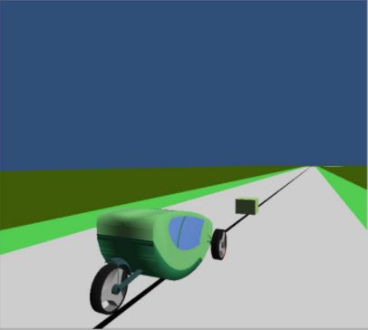
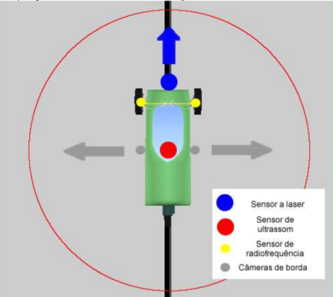
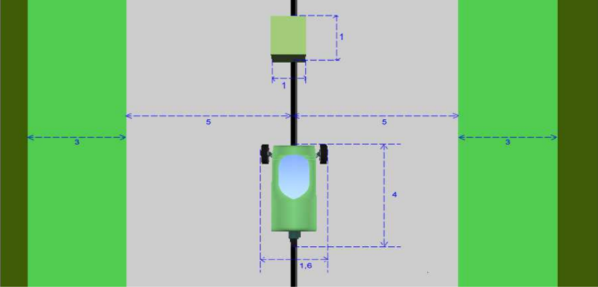
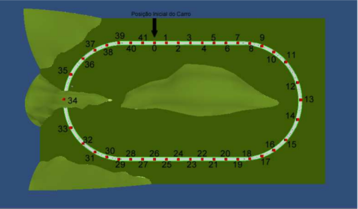

% Projeto Final - Veículo Autoguiado
% Sistemas Embarcados - UTFPR
% Francisco Miamoto - Agosto de 2021

# Introdução 

O presente documento tem por objetivo contextualizar o problema de controle de um
veículo autoguiado em uma pista com obstáculos.

O objetivo principal será garantir que o veículo se locomova dentro dos limites de uma pista oval enquanto desvia de quaisquer obstáculos presentes na mesma.

Para tal, vamos inicialmente apresentar detalhadamente as entidades que compõem o domínio deste problema.

# Entidades

##  Veículo
Entidade a ser controlada, possui a capacidade de acelerar em uma determinada direção - em ambos os sentidos - e de alterar esta mesma direção.

Possuí uma interface UART para o recebimento de comandos e a leitura dos sensores embarcados - apresentados a seguir.

## Sensores
Dispositivos presentes no *veículo* que permitem a medição da posição do veículo 
na pista bem como a presença de obstáculos.

Os sensor de radiofrequência e as câmeras de borda permitem ao *sistema* conhecer
o posicionamenoo do *veículo* - ou seja qual região da pista o mesmo se encontra.

Já os sensores a laser e de ultrassom permitem a detecção dos obstáculos na pista.

## Obstáculo
Objeto situado no centro da pista que deverá ser contornado pelo veículo para evitar colisões.

Pode ser visto na Figura 1.

## Pista

Região de locomoção do veículo.

Como podemos ver na Figura 2, a *pista* é composta de duas regiões:

- *Principal*: em cinza.
- *Lateral*: em verde claro.

Adicionalmente, temos a região *externa* à pista em verde escuro.

A região lateral e externa da pista deverão ser evitadas.

Na Figura 2 é possível também notar a presença de um condutor preto no centro da região principal da pista.

Combinado com um sensor apropriado, este condutor pode ser utilzado para determinar
a posição do *veículo* em relação ao centro da *pista*.

## Sistema
Controlador a ser desenvolvido e embarcado ao veículo para o controle do mesmo.

Será o responsável por garantir o atendimento aos requisitos impostos pelo problema.

## Usuário
Agente externo capaz de interagir com o *sistema* através de uma interface pré-definida.

Será capaz de solicitar a entrada em movimento e parada do *veículo*.

# Especificação

Conhecendo agora as entidades que compõem o dominío do problema, podemos estabelecer os requisitos desejáveis ao *sistema* controlador.

## Requisitos funcionais - RF

- RF1: O *sistema* deverá garantir que o *veículo* não atinga a região externa da *pista*.
    - RF1.1: O *sistema* deverá garantir que o veículo realize as curvas da *pista* sem intervenção do usuário.

- RF2: O *sistema* deverá garantir manter o *veículo* em uma velocidade constante quando em movimento.
    - RF2.1: O *sistema* deverá permitir a definição da velocidade mantida quando em movimento.

- RF3: O *sistema* deverá permitir ao *usuário* solicitar a parada do *veículo*.

- RF4: O *sistema* deverá permitir ao *usuário* solicitar a entrada em movimento do *veículo*.

- RF5: O *sistema* deverá solicitar a entrada em movimento do *veículo* somente após uma solicitação do *usuário*.

- RF6: O *sistema* deverá aguardar o início da comunicação do *veículo* antes de enviar qualquer comando ao mesmo.

- RF7: O *sistema* deverá garantir que o *veículo* não colida com nenhum objeto.
    - RF7.1: O *sistema* deverá garantir que *obstáculos* na *pista* serão desviados pelo *veículo*.

- RF8: O *sistema* deverá se comunicar com o *veículo* através de uma interface UART.

## Requisitos não funcionais - RNF

- RNF1: O *sistema* deverá responder a uma solicitação de parada em até 100 ms.

- RNF2: O *sistema* deverá responder a uma solicitação de entrada em movimento em até 100 ms.

- RNF3: O *sistema* deverá permitir a definição da velocidade desejada para o *veículo* quando em movimento através de um parâmetro de compilação.

- RNF4: O *sistema* deverá utilizar apenas a pista principal para os desvios de *obstáculo*.

- RNF5: O *sistema* deverá utilizar o menor número possível de *sensores*.

## Restrições - R
- R1: O sistema deverá ser implementado usado o RTOS Keil RTX5

- R2: O sistema deverá ser desenvolvido para o microcontrolador Texas Instruments 
TM4C1294

- R3: A interface entre o *usuário* e o *sistema* deverá ser realizada pelos botões incluídos na placa de desenvolvimento do microcontrolador TM4C1294.

- R3: O sistema deverá ser desenvolvido em linguagem C.

- R4: O sistema deverá realizar a comunição UART utilizando interrupções do microcontrolador.
